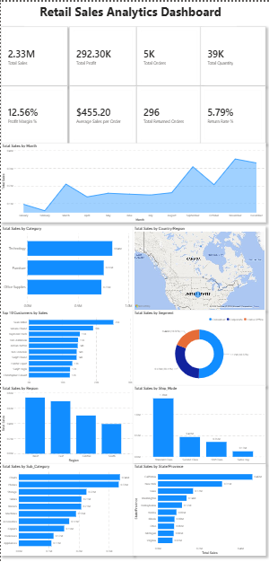
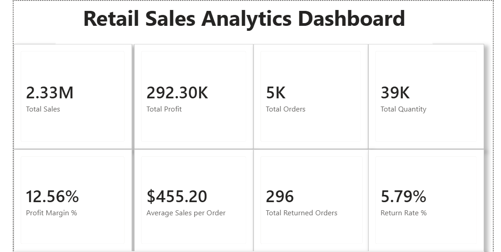
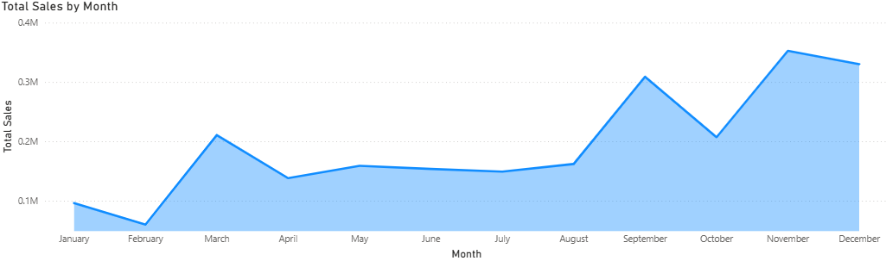
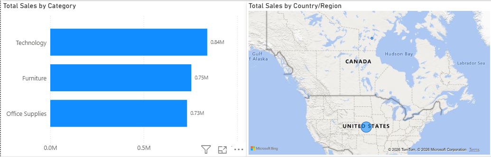
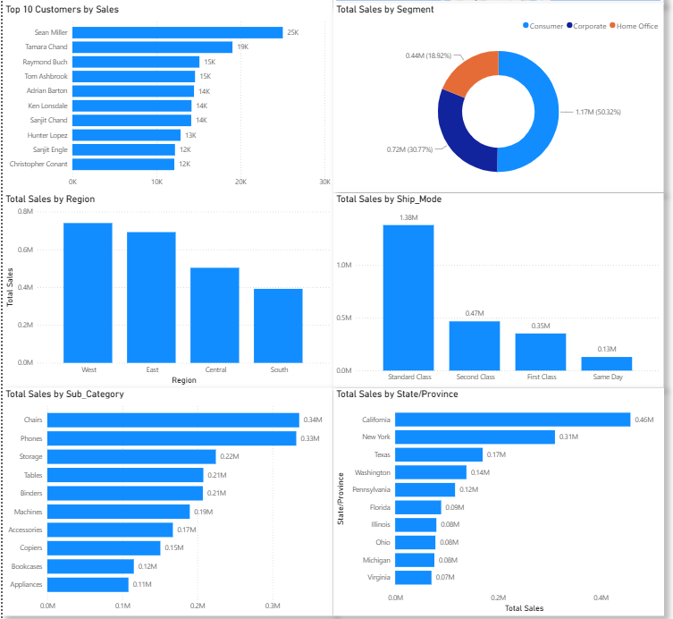

# 📊 Retail Sales Analytics Dashboard (Power BI)

An interactive **Retail Sales Analytics Dashboard** built using **Microsoft Power BI** to analyze sales performance, profitability, customer behavior, returns, and regional trends. The dashboard enables business users to monitor key performance indicators (KPIs) and make data-driven decisions through interactive visualizations and DAX-powered metrics.

---

# 🖼️ Dashboard Preview



---

# 🚀 Project Overview

This dashboard provides a comprehensive view of retail business performance by combining sales, profit, customer, return, shipping, and geographic data into a single interactive report.

The project demonstrates data modeling, Power Query transformations, DAX calculations, and dashboard design best practices in Power BI.

---

# 📈 Dashboard Features

### Executive KPIs

- Total Sales
- Total Profit
- Total Orders
- Total Quantity
- Profit Margin %
- Average Sales per Order
- Total Returned Orders
- Return Rate %

### Sales Analysis

- Monthly Sales Trend
- Sales by Category
- Sales by Country/Region
- Sales by Region
- Sales by State (Top 10)
- Sales by Sub-Category
- Sales by Segment
- Sales by Ship Mode
- Top 10 Customers by Sales

---

# 🛠️ Tech Stack

- Microsoft Power BI Desktop
- Power Query
- DAX (Data Analysis Expressions)
- Microsoft Excel

---

# 📂 Dataset

The dashboard uses a retail sales dataset containing information related to:

- Orders
- Customers
- Products
- Categories
- Sales
- Profit
- Quantity
- Discounts
- Shipping
- Returns
- Geographic Information

---

# 📊 Key DAX Measures

- Total Sales
- Total Profit
- Total Orders
- Total Quantity
- Profit Margin %
- Average Sales per Order
- Total Returned Orders
- Return Rate %

---

# 📷 Dashboard Screenshots

## KPI Section



---

## Monthly Sales Trend



---

## Category & Region Analysis



---

## Additional Insights



---

# 📁 Project Structure

```text
Retail-Sales-Analytics-Dashboard-PowerBI/
│
├── Retail_Sales_Analytics_Dashboard.pbix
├── Retail_Sales_Dataset.xlsx
├── README.md
├── LICENSE
├── .gitignore
└── assets/
    ├── dashboard.png
    ├── kpiCardSection.png
    ├── sales trend.png
    ├── category and region charts.png
    └── other important charts.png
```

---

# ⭐ Key Skills Demonstrated

- Power BI Dashboard Development
- Data Modeling
- Power Query (ETL)
- DAX Calculations
- Data Visualization
- Business Intelligence
- KPI Reporting
- Interactive Dashboard Design

---

# 👨‍💻 Author

**Rachit Sehgal**

LinkedIn: *(Add your LinkedIn profile here)*

GitHub: https://github.com/RachitSehgal19
